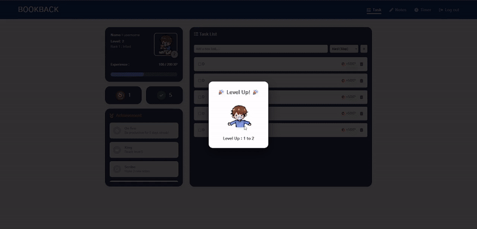

# BOOKBACK
This project is part of the CSS234 Web Programming I course. The task is to develop a website to solve a real problem that I personally encountered. using only HTML, CSS and JavaScript

My pain point is that my attention span is getting shorter while working due to excessive consumption of short-form videos such as Tiktok. Sometimes, I feel stressed and dont want to continue. When I study, I often find myself picking up my phone and scrolling, losing track of time without realizing it.

Based on this problem I developed BOOKBACK, a To-Do list website that combines traditional task management with gamification. The system simulates a character representing myself, starting from childhood, allowing users to level-up, unlock achievement and grow into working age

The website also includes features such as note, timer, goal-tracking system to make working and studying more engaging, less boring, and to help increase motivation and focus.

## PC Showcase (Responsive Supported)


## Installation With docker

### 1.Open Docker Desktop
```
Make sure Docker Desktop is running on your machine.
```

### 2.Git clone this repo
```bash
git clone https://github.com/ssrpsx/project-web-programming-I-todolist.git
```

### 3.Move to the project directory
```bash
cd project-web-programming-I-todolist
```

### 4.build docker compose
```bash
docker compose up --build
```

### 5.waiting utill to see
```
🚀 Server running on port 5500
```

### Open the website in your browser
```bash
http://localhost:5500/html/login.html
```